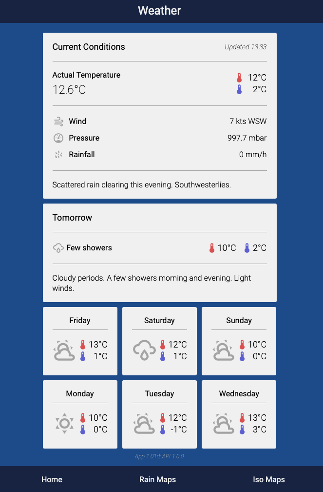
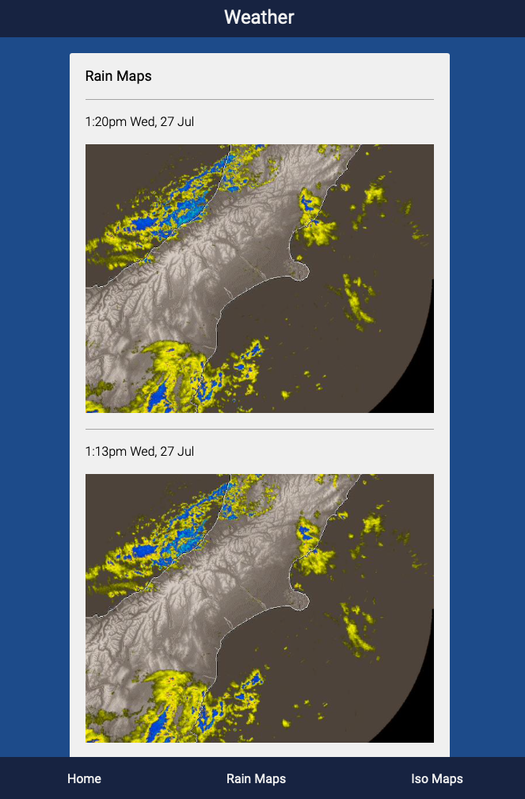
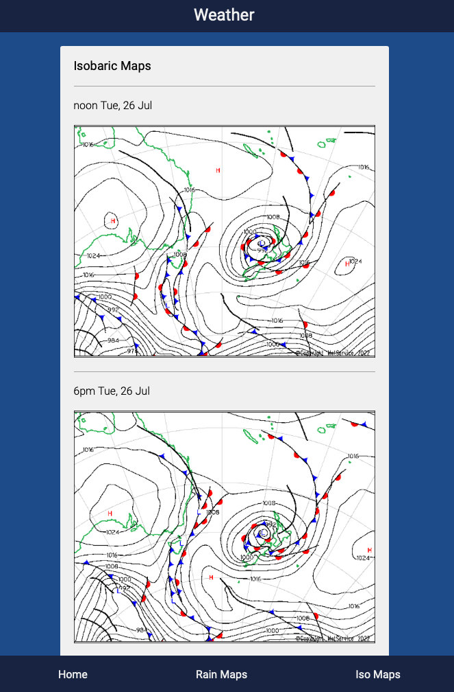

# Meteor SPA

Single Page Application for the [Meteor](https://github.com/macca717/meteor_api) weather API.

## Screenshots
### Home


### Rain Radar


### Isobaric Maps


## Development

Start a development server and file watcher;
```
npm run start
```

## Deployment

Compile the Elm runtime;
```
npm run build
```

The public folder must be statically served by a web server(Nginx, Apache etc).

## TODO

- The API server address is hard-coded
